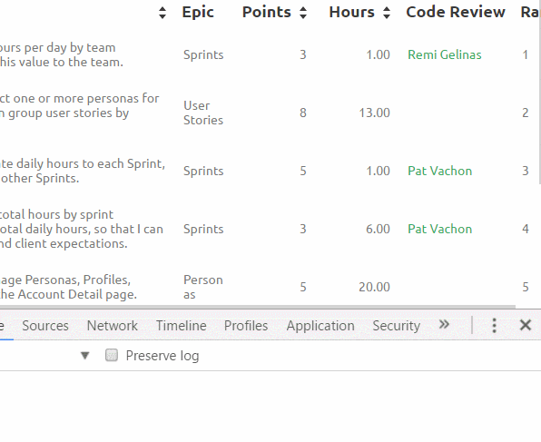

# Sortable Skuid tables!

Originally posted [here](https://community.skuid.com/skuid/topics/sort-table-with-drag-and-drop) by Matt Sones on the :octopus: skuid community. 

----------

This snippet adds placeholder styling, a spinner to the blockUI dialog and useful debug info when moving rows around. Implemented as a [master page snippet](sortable.js) invokable on child pages via this [Child page snippet](../../Inline/Sortable/Sort XXXX table.js).

 ~~~~ Available as an all-in-one standalone snippet [here](../../Inline/Sortable/Sortable Tables.js). Enjoy!.

Attaching the snippet to a table with a sortBy field will allows rows in that table to be reordered using [jQuery Sortable](https://api.jqueryui.com/sortable/).

Rows that are moved will drop in the blue outlined zone under them.

Because it leverages jQuery Sortable, this snippet can be extended with any of the features offered by jQuery Sortable (John Watson has a rich text fix available [here](https://community.skuid.com/skuid/topics/sort-table-with-drag-and-drop#reply_17745429)).